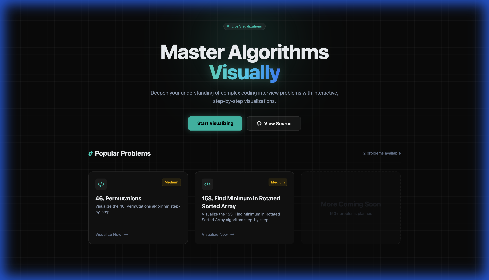
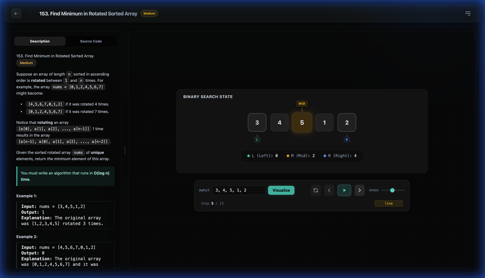

# LeetCode Visualizer 🎯

> **Interactive algorithm visualization platform for LeetCode problems**

[](https://leetcode-visualizer-monkey.vercel.app/)
[](LICENSE)

**🌐 Official Website:** [https://leetcode-visualizer-monkey.vercel.app/](https://leetcode-visualizer-monkey.vercel.app/)

## ✨ Features

- 🎬 **Step-by-step visualization** of algorithm execution
- 🎮 **Interactive controls** - Play, pause, step forward/backward, and fast-forward through algorithm steps
- 🎨 **Beautiful UI** - Modern dark theme with glassmorphic design and smooth animations
- 📊 **Multiple visualizers** - Binary Search, Permutations, Jump Game, Two Sum, and more
- 🔍 **Call stack tracking** - Visualize recursive function calls and backtracking
- ⚡ **Real-time updates** - See variable changes and algorithm state in real-time

## 🎥 Showcase

### Homepage

*Modern interface showing available algorithm visualizations*

### Binary Search Visualization (Find Minimum in Rotated Sorted Array)

*Step 5 of 8: Interactive visualization showing L (Left), M (Mid), and R (Right) pointers navigating through the rotated array [3, 4, 5, 1, 2]. The algorithm is actively searching for the minimum element.*

### Permutations with Backtracking

*Step 15: Call stack visualization demonstrating recursive backtracking with multiple active frames. Shows the algorithm exploring different permutation branches with local variables tracked in each frame.*

## 🏗 Architecture

This project is structured using Git Submodules:
-   **`core/`**: Contains the source code (Backend + Frontend). This is a submodule pointing to `leetcode-visualizer-core`.

## 🚀 Getting Started

### Prerequisites
-   Node.js (v18+) & Bun/pnpm/npm
-   Python 3.8+
-   Access to the private `leetcode-visualizer-core` repository (if you are a collaborator)

### Installation

1.  **Clone the repository with submodules:**
    ```bash
    git clone --recursive git@github.com:monkey-mode/leetcode-visualizer.git
    cd leetcode-visualizer
    ```

    *If you already cloned without recursive:*
    ```bash
    git submodule update --init --recursive
    ```

2.  **Setup Core:**
    Navigate to the core directory and follow the setup instructions there.
    ```bash
    cd core
    # Follow backend/frontend setup guide inside core/
    ```

## 🎮 Usage

Visit [https://leetcode-visualizer-monkey.vercel.app/](https://leetcode-visualizer-monkey.vercel.app/) to start visualizing algorithms immediately!

### Controls
- **▶️ Play/Pause** - Auto-play through algorithm steps
- **⏮️ Previous** - Step backward one frame
- **⏭️ Next** - Step forward one frame
- **⏪ Fast Rewind** - Jump back 10 steps
- **⏩ Fast Forward** - Jump ahead 10 steps
- **🔄 Reset** - Return to initial state
- **🎚️ Speed** - Adjust playback speed (50ms - 1000ms)

## 📝 License

MIT License - feel free to use this project for learning and educational purposes!

---

**Built with ❤️ for the coding community**
